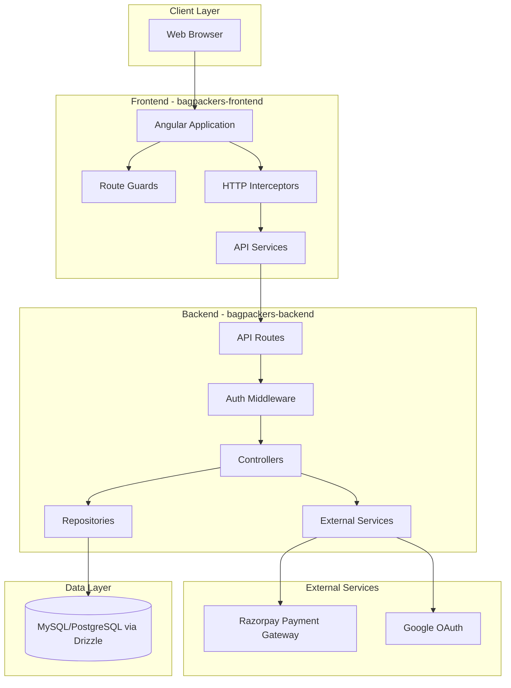
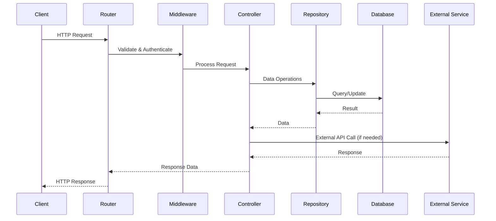

# Design Document

## Overview

The BagPackers migration will transform the existing PHP monolithic application into a modern, scalable architecture with Angular frontend and Cloudflare Workers backend. The system will be split into two independent projects:

- **bagpackers-frontend**: Angular 17+ SPA with TypeScript, reactive forms, and Angular Material UI
- **bagpackers-backend**: Cloudflare Workers API with TypeScript, Drizzle ORM, and OpenAPI documentation

The backend follows a modified DDD architecture where the flow is: **Router → Controller → Repository**, with services reserved exclusively for external integrations (Razorpay, Google OAuth).

## Architecture

### High-Level Architecture



### Backend Request Flow



## Components and Interfaces

### Backend Structure (bagpackers-backend)

```
bagpackers-backend/
├── src/
│   ├── constants/
│   │   └── app.constants.ts          # App-wide constants
│   ├── controllers/
│   │   ├── auth/
│   │   │   └── auth.controller.ts    # Login, register, OAuth logic
│   │   ├── booking/
│   │   │   └── booking.controller.ts # Booking business logic
│   │   ├── partner/
│   │   │   └── partner.controller.ts # Partner registration logic
│   │   └── payment/
│   │       └── payment.controller.ts # Payment processing logic
│   ├── exceptions/
│   │   ├── core.exceptions.ts
│   │   ├── auth.exceptions.ts
│   │   ├── booking.exceptions.ts
│   │   └── payment.exceptions.ts
│   ├── infrastructure/
│   │   ├── di/
│   │   │   └── container.ts          # TSyringe DI container
│   │   ├── core.model.ts
│   │   ├── customAPIRoute.ts
│   │   └── types.ts
│   ├── middlewares/
│   │   └── auth.middleware.ts        # JWT validation
│   ├── models/
│   │   ├── auth/
│   │   │   └── user.model.ts
│   │   ├── booking/
│   │   │   └── booking.model.ts
│   │   ├── partner/
│   │   │   └── partner.model.ts
│   │   └── payment/
│   │       └── payment.model.ts
│   ├── repository/
│   │   ├── auth/
│   │   │   └── user.repository.ts
│   │   ├── booking/
│   │   │   └── booking.repository.ts
│   │   ├── partner/
│   │   │   └── partner.repository.ts
│   │   ├── payment/
│   │   │   └── payment.repository.ts
│   │   ├── repository.ts             # Base repository
│   │   └── schema.ts                 # Drizzle schemas
│   ├── routes/
│   │   ├── auth/
│   │   │   ├── login.route.ts
│   │   │   ├── register.route.ts
│   │   │   └── oauth.route.ts
│   │   ├── booking/
│   │   │   ├── create-booking.route.ts
│   │   │   ├── get-bookings.route.ts
│   │   │   └── get-locations.route.ts
│   │   ├── partner/
│   │   │   └── register-partner.route.ts
│   │   └── payment/
│   │       ├── create-order.route.ts
│   │       └── verify-payment.route.ts
│   ├── services/
│   │   ├── razorpay/
│   │   │   └── razorpay.service.ts   # Razorpay integration
│   │   └── oauth/
│   │       └── google-oauth.service.ts # Google OAuth integration
│   ├── utils/
│   │   ├── Logger.ts
│   │   ├── Response.utils.ts
│   │   └── jwt.utils.ts
│   └── index.ts                      # Main entry point
├── drizzle.config.ts
├── wrangler.toml
├── package.json
└── tsconfig.json
```

### Frontend Structure (bagpackers-frontend)

```
bagpackers-frontend/
├── src/
│   ├── app/
│   │   ├── core/
│   │   │   ├── guards/
│   │   │   │   └── auth.guard.ts
│   │   │   ├── interceptors/
│   │   │   │   ├── auth.interceptor.ts
│   │   │   │   └── error.interceptor.ts
│   │   │   ├── services/
│   │   │   │   ├── auth.service.ts
│   │   │   │   └── storage.service.ts
│   │   │   └── models/
│   │   │       ├── user.model.ts
│   │   │       ├── booking.model.ts
│   │   │       └── api-response.model.ts
│   │   ├── features/
│   │   │   ├── auth/
│   │   │   │   ├── components/
│   │   │   │   │   ├── login/
│   │   │   │   │   └── signup/
│   │   │   │   ├── services/
│   │   │   │   │   └── auth-api.service.ts
│   │   │   │   └── auth.module.ts
│   │   │   ├── booking/
│   │   │   │   ├── components/
│   │   │   │   │   ├── dashboard/
│   │   │   │   │   ├── booking-form/
│   │   │   │   │   └── location-map/
│   │   │   │   ├── services/
│   │   │   │   │   └── booking-api.service.ts
│   │   │   │   └── booking.module.ts
│   │   │   ├── payment/
│   │   │   │   ├── components/
│   │   │   │   │   └── payment-form/
│   │   │   │   ├── services/
│   │   │   │   │   └── payment-api.service.ts
│   │   │   │   └── payment.module.ts
│   │   │   ├── partner/
│   │   │   │   ├── components/
│   │   │   │   │   ├── partner-landing/
│   │   │   │   │   └── partner-form/
│   │   │   │   ├── services/
│   │   │   │   │   └── partner-api.service.ts
│   │   │   │   └── partner.module.ts
│   │   │   └── landing/
│   │   │       ├── components/
│   │   │       │   └── landing-page/
│   │   │       └── landing.module.ts
│   │   ├── shared/
│   │   │   ├── components/
│   │   │   │   ├── navbar/
│   │   │   │   ├── footer/
│   │   │   │   └── city-selector/
│   │   │   ├── directives/
│   │   │   └── pipes/
│   │   ├── app.component.ts
│   │   ├── app.routes.ts
│   │   └── app.config.ts
│   ├── assets/
│   │   └── images/
│   ├── environments/
│   │   ├── environment.ts
│   │   └── environment.prod.ts
│   └── styles.css
├── angular.json
├── package.json
└── tsconfig.json
```

## Data Models

### Database Schema (Drizzle ORM)

```typescript
// Users Table
export const users = mysqlTable('users', {
  id: serial('id').primaryKey(),
  firstName: varchar('first_name', { length: 100 }).notNull(),
  lastName: varchar('last_name', { length: 100 }).notNull(),
  email: varchar('email', { length: 255 }).notNull().unique(),
  password: varchar('password', { length: 255 }), // nullable for OAuth users
  authProvider: varchar('auth_provider', { length: 50 }).default('local'), // 'local' or 'google'
  createdAt: timestamp('created_at').defaultNow(),
  updatedAt: timestamp('updated_at').defaultNow().onUpdateNow(),
});

// Bookings Table
export const bookings = mysqlTable('bookings', {
  id: serial('id').primaryKey(),
  userId: int('user_id').notNull().references(() => users.id),
  region: varchar('region', { length: 255 }).notNull(),
  city: varchar('city', { length: 100 }).notNull(),
  numberOfBags: int('number_of_bags').notNull(),
  dropOffDate: date('drop_off_date').notNull(),
  pickupDate: date('pickup_date').notNull(),
  totalCost: decimal('total_cost', { precision: 10, scale: 2 }).notNull(),
  status: varchar('status', { length: 50 }).default('pending'), // 'pending', 'confirmed', 'completed', 'cancelled'
  createdAt: timestamp('created_at').defaultNow(),
  updatedAt: timestamp('updated_at').defaultNow().onUpdateNow(),
});

// Payments Table
export const payments = mysqlTable('payments', {
  id: serial('id').primaryKey(),
  bookingId: int('booking_id').notNull().references(() => bookings.id),
  razorpayOrderId: varchar('razorpay_order_id', { length: 255 }),
  razorpayPaymentId: varchar('razorpay_payment_id', { length: 255 }),
  razorpaySignature: varchar('razorpay_signature', { length: 255 }),
  amount: decimal('amount', { precision: 10, scale: 2 }).notNull(),
  currency: varchar('currency', { length: 10 }).default('INR'),
  status: varchar('status', { length: 50 }).default('pending'), // 'pending', 'success', 'failed'
  createdAt: timestamp('created_at').defaultNow(),
  updatedAt: timestamp('updated_at').defaultNow().onUpdateNow(),
});

// Partners Table
export const partners = mysqlTable('partners', {
  id: serial('id').primaryKey(),
  fullName: varchar('full_name', { length: 255 }).notNull(),
  region: varchar('region', { length: 255 }).notNull(),
  mobileNumber: varchar('mobile_number', { length: 20 }).notNull(),
  address: text('address').notNull(),
  status: varchar('status', { length: 50 }).default('pending'), // 'pending', 'approved', 'rejected'
  createdAt: timestamp('created_at').defaultNow(),
  updatedAt: timestamp('updated_at').defaultNow().onUpdateNow(),
});

// Partner Locations Table (for map display)
export const partnerLocations = mysqlTable('partner_locations', {
  id: serial('id').primaryKey(),
  partnerId: int('partner_id').notNull().references(() => partners.id),
  region: varchar('region', { length: 255 }).notNull(),
  city: varchar('city', { length: 100 }).notNull(),
  latitude: decimal('latitude', { precision: 10, scale: 8 }),
  longitude: decimal('longitude', { precision: 11, scale: 8 }),
  availableSpaces: int('available_spaces').default(0),
  pricePerBag: decimal('price_per_bag', { precision: 10, scale: 2 }).default('30.00'),
  createdAt: timestamp('created_at').defaultNow(),
  updatedAt: timestamp('updated_at').defaultNow().onUpdateNow(),
});
```

### TypeScript Models

```typescript
// User Model
export interface User {
  id: number;
  firstName: string;
  lastName: string;
  email: string;
  authProvider: 'local' | 'google';
  createdAt: Date;
}

// Booking Model
export interface Booking {
  id: number;
  userId: number;
  region: string;
  city: string;
  numberOfBags: number;
  dropOffDate: string;
  pickupDate: string;
  totalCost: number;
  status: 'pending' | 'confirmed' | 'completed' | 'cancelled';
  createdAt: Date;
}

// Payment Model
export interface Payment {
  id: number;
  bookingId: number;
  razorpayOrderId?: string;
  razorpayPaymentId?: string;
  amount: number;
  currency: string;
  status: 'pending' | 'success' | 'failed';
  createdAt: Date;
}

// Partner Model
export interface Partner {
  id: number;
  fullName: string;
  region: string;
  mobileNumber: string;
  address: string;
  status: 'pending' | 'approved' | 'rejected';
  createdAt: Date;
}

// Location Model
export interface PartnerLocation {
  id: number;
  partnerId: number;
  region: string;
  city: string;
  latitude?: number;
  longitude?: number;
  availableSpaces: number;
  pricePerBag: number;
}
```

## API Endpoints

### Authentication Endpoints

```
POST /api/auth/register
- Body: { firstName, lastName, email, password, confirmPassword }
- Response: { token, user }

POST /api/auth/login
- Body: { email, password }
- Response: { token, user }

GET /api/auth/google
- Query: { code }
- Response: { token, user }

GET /api/auth/me (Protected)
- Headers: { Authorization: Bearer <token> }
- Response: { user }
```

### Booking Endpoints

```
POST /api/bookings (Protected)
- Headers: { Authorization: Bearer <token> }
- Body: { region, city, numberOfBags, dropOffDate, pickupDate }
- Response: { booking }

GET /api/bookings (Protected)
- Headers: { Authorization: Bearer <token> }
- Response: { bookings: [] }

GET /api/bookings/:id (Protected)
- Headers: { Authorization: Bearer <token> }
- Response: { booking }

GET /api/locations
- Query: { region, city }
- Response: { locations: [] }
```

### Payment Endpoints

```
POST /api/payments/create-order (Protected)
- Headers: { Authorization: Bearer <token> }
- Body: { bookingId }
- Response: { orderId, amount, currency }

POST /api/payments/verify (Protected)
- Headers: { Authorization: Bearer <token> }
- Body: { razorpayOrderId, razorpayPaymentId, razorpaySignature, bookingId }
- Response: { success, payment }
```

### Partner Endpoints

```
POST /api/partners/register
- Body: { fullName, region, mobileNumber, address }
- Response: { partner }

GET /api/partners (Admin - Future)
- Response: { partners: [] }
```

## Error Handling

### Backend Error Strategy

1. **Custom Exception Classes**: Define domain-specific exceptions
   ```typescript
   export class AuthenticationException extends Error {
     constructor(message: string, public code: string = 'AUTH_ERROR') {
       super(message);
     }
   }
   
   export class BookingValidationException extends Error {
     constructor(message: string, public code: string = 'BOOKING_VALIDATION_ERROR') {
       super(message);
     }
   }
   ```

2. **Error Response Format**:
   ```typescript
   {
     success: false,
     error: {
       code: 'AUTH_ERROR',
       message: 'Invalid credentials',
       details: {} // optional
     }
   }
   ```

3. **HTTP Status Codes**:
   - 200: Success
   - 201: Created
   - 400: Bad Request (validation errors)
   - 401: Unauthorized (authentication required)
   - 403: Forbidden (insufficient permissions)
   - 404: Not Found
   - 500: Internal Server Error

### Frontend Error Handling

1. **HTTP Interceptor**: Catch all HTTP errors and transform them
2. **Error Service**: Centralized error handling and user notifications
3. **Form Validation**: Real-time validation with error messages
4. **Toast Notifications**: User-friendly error messages using Angular Material Snackbar

## Testing Strategy

### Backend Testing

1. **Unit Tests**: Test controllers and repositories in isolation
   - Mock external services (Razorpay, Google OAuth)
   - Test business logic in controllers
   - Test data operations in repositories

2. **Integration Tests**: Test API endpoints end-to-end
   - Test authentication flow
   - Test booking creation and retrieval
   - Test payment processing

3. **Tools**: Vitest for unit and integration tests

### Frontend Testing

1. **Unit Tests**: Test components, services, and pipes
   - Test component logic
   - Test service methods
   - Test form validation

2. **Integration Tests**: Test feature modules
   - Test routing and navigation
   - Test API integration
   - Test user workflows

3. **E2E Tests**: Test critical user journeys
   - User registration and login
   - Booking creation and payment
   - Partner registration

4. **Tools**: Jasmine/Karma for unit tests, Cypress for E2E tests

## Security Considerations

### Authentication & Authorization

1. **JWT Tokens**: 
   - Short-lived access tokens (1 hour)
   - Secure token storage in httpOnly cookies or localStorage with XSS protection
   - Token refresh mechanism

2. **Password Security**:
   - Hash passwords using bcrypt with salt rounds >= 10
   - Enforce minimum password length (6 characters)
   - Validate password strength on frontend

3. **OAuth Security**:
   - Validate OAuth state parameter
   - Verify OAuth tokens with Google
   - Store OAuth tokens securely

### API Security

1. **CORS Configuration**: Whitelist frontend domain
2. **Rate Limiting**: Implement rate limiting on authentication endpoints
3. **Input Validation**: Validate all inputs using Zod schemas
4. **SQL Injection Prevention**: Use Drizzle ORM parameterized queries
5. **XSS Prevention**: Sanitize user inputs, use Angular's built-in XSS protection

### Payment Security

1. **Razorpay Integration**:
   - Never expose API keys on frontend
   - Verify payment signatures on backend
   - Use HTTPS for all payment communications
   - Implement webhook verification for payment callbacks

## Deployment Strategy

### Backend Deployment (Cloudflare Workers)

1. **Environment Variables**:
   - Database connection string
   - JWT secret
   - Razorpay API keys
   - Google OAuth credentials

2. **Deployment Steps**:
   ```bash
   cd bagpackers-backend
   npm run build
   wrangler deploy
   ```

3. **Database Migrations**:
   ```bash
   npx drizzle-kit generate
   npx drizzle-kit push
   ```

### Frontend Deployment

1. **Build Configuration**:
   - Production build with AOT compilation
   - Environment-specific API URLs
   - Asset optimization

2. **Deployment Options**:
   - Cloudflare Pages
   - Vercel
   - Netlify
   - AWS S3 + CloudFront

3. **Deployment Steps**:
   ```bash
   cd bagpackers-frontend
   npm run build
   # Deploy dist folder to hosting provider
   ```

## Migration Plan

### Phase 1: Backend Setup
1. Initialize bagpackers-backend project
2. Set up Drizzle ORM and database schema
3. Implement authentication endpoints
4. Implement booking endpoints
5. Integrate Razorpay payment service
6. Integrate Google OAuth service

### Phase 2: Frontend Setup
1. Initialize bagpackers-frontend Angular project
2. Set up routing and navigation
3. Implement authentication module
4. Implement booking module
5. Implement payment module
6. Implement partner module

### Phase 3: Data Migration
1. Export data from existing PHP MySQL database
2. Transform data to match new schema
3. Import data into new database
4. Verify data integrity

### Phase 4: Testing & Deployment
1. Perform integration testing
2. Perform E2E testing
3. Deploy backend to Cloudflare Workers
4. Deploy frontend to hosting provider
5. Configure DNS and SSL certificates
6. Monitor and fix issues

## Performance Optimization

### Backend Optimization
1. **Database Indexing**: Index frequently queried columns (email, userId, bookingId)
2. **Caching**: Implement caching for city/location data using Cloudflare KV
3. **Query Optimization**: Use Drizzle's query builder for efficient queries
4. **Connection Pooling**: Configure database connection pooling

### Frontend Optimization
1. **Lazy Loading**: Lazy load feature modules
2. **Code Splitting**: Split bundles by route
3. **Image Optimization**: Use WebP format, lazy load images
4. **CDN**: Serve static assets from CDN
5. **Service Worker**: Implement PWA features for offline support
